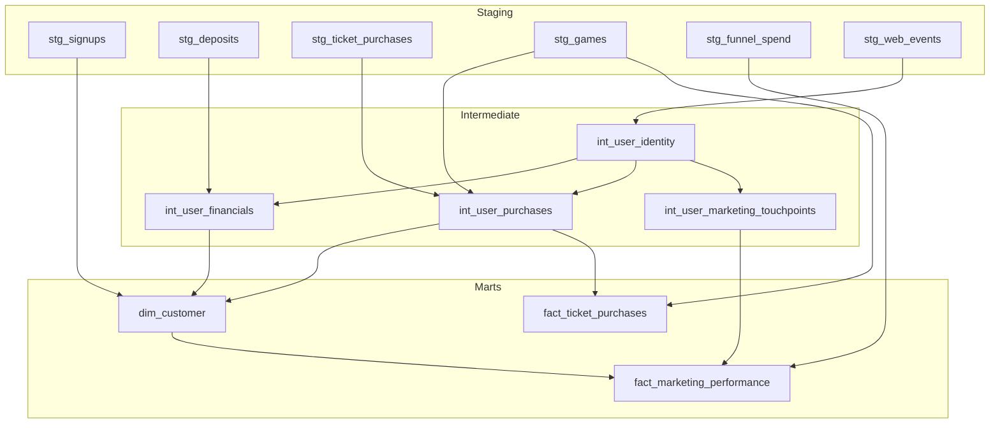

# Zeal Case Study

## 1. Executive Summary & Objective

This case study demonstrates the design of an end-to-end analytics pipeline for a lottery e-commerce platform.

- **Objective**: To build a robust, governed dbt pipeline that enables marketing attribution, ROAS calculation, and player behavior analysis.
- **Focus**: Acquire new players, drive repeat engagement, and enable self-service analytics for marketing teams.  
- **Scope**: Track player signups, deposits, ticket purchases, marketing spend, and web events to generate trusted metrics.

---

## 2. Business Questions

This project is explicitly designed to answer the following case study business questions:

### 1. What is our Return on Ad Spend (ROAS), measured by players’ first-time deposits?

- ROAS, or Return on Ad Spend, measures how effectively the marketing investment turns into revenue from new players.
- ROAS is calculated as: 
      **ROAS = Sum of first-time deposit revenue / Marketing spend**
- Only each player’s first deposit is counted, so we focus on new user acquisition, not repeat behavior.
- Marketing spend is matched to the player based on their first marketing interaction, giving a clear picture of which campaigns and channels actually drove deposits.
- Finally, we aggregate the results at the campaign and channel level, ensuring revenue and spend are properly aligned so marketing teams can see which initiatives generate the best returns.

### 2. What is the average time from a user’s first marketing interaction to their first ticket purchase?

- Calculated at the user level as the difference between:
      - `first_marketing_timestamp`
      - `first_ticket_purchase_timestamp`

### 3. Which marketing channels are most effective at acquiring players who participate in high-jackpot games?

- A high-jackpot player is any user who has purchased a lottery ticket for a game where the jackpot estimate exceeds USD 100,000. This identifies players most engaged with the highest-value games.
- We measure channel effectiveness by looking at two key metrics:
      - The number of high-jackpot players acquired through each marketing channel.
      - The conversion rate of users from initial acquisition to actually participating in a high-jackpot game.
- Attribution is based on the user’s first marketing touch, which is then joined to their deposit and purchase behavior. This approach lets us see which channels are truly driving high-value players, providing actionable insights for marketing strategy.

---

## 3. Data Architecture & DAG

---

## Layering Strategy

- **Staging Layer:** Clean, standardize, and cast raw data types. Lightweight views to reduce storage cost.
- **Intermediate Layer:** Tables that perform identity stitching and aggregate per-user metrics; reusable across multiple marts.
- **Mart Layer:** Incremental tables that are analytics-ready, optimized for performance and stability.

> **Note:** This follows the Medallion Architecture (Bronze → Silver → Gold) by gradually refining raw data into trusted, high-quality analytics outputs.

---

## Materialization Justification

| Layer        | Model Type   | Reason                                                                                     |
|--------------|-------------|--------------------------------------------------------------------------------------------|
| Staging      | View        | Staging models are lightweight and low-cost, always up-to-date. They clean, typecast, and standardize raw data without creating duplicates. This ensures downstream models have a fresh, consistent foundation for analyzing user behavior, conversion timing, and marketing attribution at the channel level.                                      |
| Intermediate | Table       | Intermediate tables aggregate user-level metrics and stitched identities, reducing the need for repeated heavy joins. They provide a stable view of each user's events, making calculations like the time from first marketing touch to first purchase accurate. This layer improves performance and supports precise first-touch attribution for ROAS and campaign analysis.             |
| Mart         | Incremental | Marts handle high-volume analytical tables efficiently. Incremental refresh preserves historical data while updating only new or changed rows, ensuring metrics like ROAS, conversion timing, and high-jackpot channel effectiveness remain accurate. This makes reporting on campaigns and channels over time faster, reliable, and scalable for business decision-making. |

---

## 4. Key Design Choices & Business Logic

### Identity Stitching
- Identity stitching is used in a way to connect all the different IDs a user may have into one single, consistent user profile.
- In this case study, a user might first browse as an anonymous visitor (`anonymous_user_id`) and later sign up (`user_id`). Using COALESCE(`user_id`, `anonymous_user_id`), we merge these into a unified identity.
- This unified ID allows us to see the full journey of a user: their first marketing touch, first deposit, and first ticket purchase, without gaps or misalignment.
- It ensures key metrics like conversion timing, channel effectiveness, and ROAS are accurate, because every event is correctly attributed to the same user.
- It prevents double-counting and inconsistent reporting, giving marketing and analytics teams reliable insights.
- Maintaining a stable, consistent identifier across all models means downstream analyses, dashboards, and reports are trustworthy and actionable, helping the business make informed decisions.

### Currency Handling
> All financial metrics were standardized to USD, matching the `purchase_amount_usd` convention used in the source tables,  by dividing minor units (`inminor`) by 100 to ensure consistency in ROAS calculations and deposit aggregations.

### Attribution
- Defined **First Marketing Interaction** as the earliest `event_timestamp` per user from `web_events`.
- Supports first-touch attribution for ROAS, conversion timing, and channel effectiveness.

---

## 5. Governance & Data Contracts

### Testing
Custom data tests enforce business-critical rules, ensuring that the Governance framework validates data integrity and logical consistency across the entire player lifecycle:

| Test                          | Purpose                                                                 |
|-------------------------------|-------------------------------------------------------------------------|
| `first_purchase_after_signup` | Ensures ticket purchases do not occur before signup                     |
| `first_deposit_after_marketing` | Verifies deposits happen after first marketing interaction             |
| `high_jackpot_flag_valid`     | Confirms high-jackpot participation aligns with ticket data             |
| `not_null/unique`             | Guarantees essential columns (`user_id`, `event_id`) are always present and unique |

### Documentation
- Each model in the project has a corresponding `schema.yml` that clearly describes every column, its purpose, and its role in the analytics workflow.
- This documentation serves as a guide for marketing analysts and data consumers, helping them understand exactly what each metric represents and how to interpret it.
- It also provides context for the transformations applied at each layer, so users can confidently rely on the data without needing to inspect raw tables or intermediate logic.

### Contracts
- All mart-layer tables have enforced data contracts (schema YAMLs) that automatically validate the structure and quality of the data.
- These contracts ensure key business rules and integrity constraints are always applied, such as uniqueness of user IDs or correct ordering of events.
- This guarantees that downstream teams, including marketing analysts and BI dashboards, can trust the data for decision-making without manually checking the source systems.
- Essentially, the data contracts act as a safety net, maintaining consistency, reliability, and confidence in the analytics outputs.

---

## 6. Project Evolution: Customer LTV

- As part of evolving this analytics project, if the VIP team requested a way to identify high-value players for targeted promotions and the plan would be to incorporate a Customer Lifetime Value (LTV) score into our `dim_customer model`.

- Discovery: I would start by meeting with the VIP team to define the LTV calculation. For example, we might define LTV as total revenue from deposits and ticket purchases minus marketing costs or other acquisition expenses. The goal would be to make the score actionable for marketing campaigns and player retention strategies.

- Development: Next, I would build an intermediate model, `int_user_ltv`, that aggregates each user’s historical deposits and purchases over time. This model would also incorporate any cost data needed to compute net LTV. Aggregating at the user level ensures we have a clean and single source of truth for each customer.

- Integration: Once the intermediate LTV model is validated, I would join it into `dim_customer` as a new column, `customer_ltv`. This would allow all existing analytics and reporting to automatically include the LTV metric, enabling segmentation, cohort analysis, and campaign targeting.

- Validation: To ensure correctness, I would add custom tests such as `customer_ltv >= 0` and cross-check aggregates against historical revenue and deposits. This would ensure that the LTV scores are accurate and consistent with other data in the warehouse.

- Deployment: Finally, the workflow would be deployed via the CI/CD pipeline with a peer review, including schema updates, documentation, and tests. Once live, marketing analysts and data consumers can use the LTV metric confidently to drive business decisions and targeted campaigns.